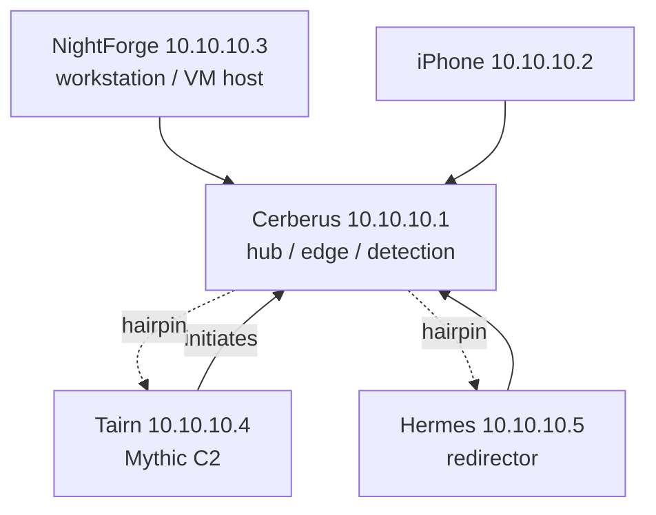

# Veil — Infrastructure Architecture

**Status:** Current-state (production) architecture.
**Last updated:** 2026-08-02
**See also:** [docs/ARCHITECTURE-v2.md](docs/ARCHITECTURE-v2.md) — design proposal for a cloud-native/hybrid (Oracle Cloud + Cloudflare Tunnel) evolution. This document describes what runs today; that one describes where it is headed.

> All network addresses in this document use the public placeholder scheme (`10.10.10.x`, `10.10.11.x`). Real addresses are never committed. See [SECURITY.md](SECURITY.md#sanitization-scheme).

---

## 1. Overview

Veil is the operational infrastructure layer of CR1MS0N Security. It is a four-node (plus one mobile client) WireGuard mesh with hub-and-spoke topology, purpose-built for red team infrastructure research: adversary emulation, threat detection, and C2 operations against operator-owned lab targets.

Two invariants define the design:

1. **No node is directly reachable from WAN.** All inter-node communication rides the WireGuard mesh; anything exposed to the internet is a deliberately disposable component (honeypot, redirector).
2. **Everything is rebuildable from the repo.** Tairn is fully declarative (NixOS), Hermes is disposable and recreated on demand, Cerberus services are Quadlet units, and this repository is the configuration source of truth.

---

## 2. Node Roles

| Node | Role | OS | Placeholder IP | Hosting |
|------|------|----|----------------|---------|
| **Cerberus** | Edge node — services, detection, honeypot, mesh hub | Arch Linux (headless) | `10.10.10.1` (mesh hub) | Chromebook, always-on |
| **NightForge** | Operator workstation — tooling, compute, VM host | Arch Linux + Niri | `10.10.10.3` | Desktop (i3-10105F, 32 GB RAM, GTX 1650) |
| **Tairn** | Attack node — Mythic C2, agent staging, lab targets | NixOS 24.11 (declarative) | `10.10.10.4` | libvirt VM on NightForge |
| **Hermes** | Redirector — C2 egress, disposable | Alpine Linux 3.23.3 | `10.10.10.5` | libvirt VM on NightForge |
| **iPhone** | Mobile WireGuard client | iOS | `10.10.10.2` | — |

### Cerberus — Edge Node

The perimeter sensor and services hub. Runs rootless Podman Quadlets under systemd (user units) plus a small set of system-level services.

- **Detection:** Cowrie SSH honeypot (port 22), Suricata network IDS (af-packet on the WAN-facing interface)
- **Services:** Gitea (git.lan), Vaultwarden (vault.lan), Pi-hole (pihole.lan, DNS + `.lan` resolution), Caddy (TLS reverse proxy, local CA), Netdata, SearXNG (search.lan), Homepage NOC dashboard (dash.lan), Glances, Beszel
- **Automation:** NightForge Shield scoring engine → nftables blackhole (1 hr TTL) + Nuclei scan queue
- **Firewall:** nftables, default-deny input; WireGuard mesh allowlist; dynamic blackhole set

### NightForge — Operator Workstation

Primary operator environment and the only physical machine with VM capability. All offensive tooling, development, and infrastructure management run here.

- **VM host:** Tairn and Hermes run under libvirt (NAT). Domain XML is committed in `configs/libvirt/`
- **Tooling:** Podman rootless profiles (ad, re, web, toolbox), Neovim + LSP, Ollama local inference
- **Related project:** workstation configuration lives in the separate [nightforge](https://github.com/CR1MS0N-Operator/nightforge) repo

### Tairn — Attack Node (C2)

NixOS 24.11 VM, fully declarative — the entire OS state is version-controlled in `configuration.nix` (tracked on Tairn; not committed to this repo). Dedicated to offensive operations and course lab work.

- **C2 framework:** Mythic (Docker-based); **primary agent:** Poseidon (Go, Linux); HTTP C2 profile
- **Access:** WireGuard-only. Mythic UI (`:7443`) is locked to the mesh via a DOCKER-USER iptables chain
- **Courses:** CRTA / CRT-ID via CyberWarfare Labs — every technique reproduced in the lab, writeups committed to `security-research/`

### Hermes — Redirector VM

Minimal Alpine VM serving as the C2 egress redirector. Nginx terminates external-facing TLS and proxies to Mythic on Tairn.

- **Disposable lifecycle:** provision → configure → connect → burn → rebuild (target < 5 minutes)
- **Purpose:** operational security layer — if the redirector is compromised it holds no persistent secrets, and it is replaced at configurable intervals
- **Access:** WireGuard-only; no direct LAN path

---

## 3. Network Topology

### 3.1 Planes

| Plane | Network | Nodes | Purpose |
|-------|---------|-------|---------|
| Physical LAN | `10.10.10.0/24` (placeholder) | Cerberus, NightForge | Home network, bridged by WireGuard |
| libvirt NAT | `10.10.11.0/24` (placeholder) | Tairn, Hermes | VM egress, NightForge-local only |
| WireGuard mesh | `10.10.10.0/24` (placeholder) | All nodes + iPhone | Primary inter-node transport |
| Air-gapped lab | virbr1 (isolated) | Lab AD VMs | Isolated training network, no host access |

### 3.2 Mesh Rules (locked)

- **Hub-and-spoke via Cerberus.** All spoke-to-spoke traffic hairpins through the hub (`iif "wg0" oif "wg0" accept`, `rp_filter=0` on wg0)
- **Tairn initiates to Cerberus only.** Cerberus has no endpoint entry for Tairn — WireGuard learns it dynamically
- **NightForge reaches Tairn/Hermes via WireGuard IPs only** — never via libvirt NAT addresses
- **Cerberus cannot reach the libvirt NAT plane.** VM NAT is NightForge-local
- Spoke peers must use `AllowedIPs = 10.10.10.0/24` (full mesh), not a single-host `/32`
- WireGuard on NightForge: `sudo resolvconf -u && sudo wg-quick up wg0`



---

## 4. Data Flows

### 4.1 Operator → C2 (NightForge → Tairn)

```
NightForge ──wg0── Cerberus (hairpin forward) ──wg0── Tairn:7443 (Mythic UI)
```

nftables hairpin forwarding accepts `wg0 → wg0`. The Mythic web UI is reachable only over the mesh; DOCKER-USER on Tairn restricts `:7443` to the mesh range.

### 4.2 C2 Agent Callback (Internet → Hermes → Tairn)

```
WAN ──► Cerberus (port forward) ──► Hermes:443 (Nginx TLS termination)
                                          │
                                          └──► Tairn:7443 (Mythic C2)
```

Hermes terminates the external-facing TLS and forwards to Mythic. The redirector is the only node with a WAN-facing path toward the C2, and it is disposable by design.

### 4.3 Internet Threat Hunting (Cerberus)

```
WAN ── Cerberus
        ├── Suricata (af-packet, all traffic) ──► fast.log ──┐
        └── Cowrie (port 22, fake SSH) ──► cowrie.json ──────┤
                                                             ▼
                                             NightForge Shield (scoring)
                                                             │
                                       score ≥ 4 ────────────┤
                                                             ▼
                              nftables blackhole (1 hr TTL) + scan queue
```

Shield scoring: `suricata_exploit +3`, `suricata_c2 +5`, `suricata_scan +1`, `suricata_alert +2`, `cowrie_login +4`, `cowrie_command +3`, `cowrie_download +5`. Threshold ≥ 4 → 1-hour nftables blackhole; blocked IPs are enqueued for optional Nuclei recon.

### 4.4 Service Access (mesh → Cerberus `.lan`)

```
NightForge ──wg0── Cerberus:8489 (Caddy)
                     ├── git.lan:8486 / gitea.lan:3000
                     ├── dash.lan:8282
                     ├── vault.lan:8081
                     ├── search.lan:8888
                     └── pihole.lan:8083
```

All `.lan` services are served over TLS via Caddy local CA. Pi-hole resolves `.lan` for mesh nodes; the CA root is installed on NightForge.

---

## 5. Security Boundaries

| Boundary | Control |
|----------|---------|
| Network segmentation | WireGuard mesh — no node directly reachable from WAN |
| C2 access control | DOCKER-USER iptables — `:7443` restricted to mesh range |
| C2 redirector | Hermes — disposable Alpine Nginx proxy between WAN and Mythic |
| Traffic isolation | Hub-and-spoke; all spoke-to-spoke traffic routes through Cerberus |
| Container isolation | Rootless Podman Quadlets (Cerberus); Docker on Tairn only (Mythic requirement) |
| VM isolation | Air-gapped libvirt network (virbr1) for AD labs; NAT networks for Tairn/Hermes |
| Secret management | Vaultwarden + `/etc/containers/secrets/` env injection for Quadlets |
| DNS | Pi-hole (`.lan` resolution + ad/tracker sinkhole) |
| TLS | Caddy local CA (`.lan` services); Nginx self-signed (Hermes) |
| SSH | Key-only auth; port 22 is the Cowrie honeypot; real SSH on 2121 |
| Intrusion detection | Suricata 8.0.3 (IDS), Cowrie 2.9.13 (honeypot) |
| Automated blocking | Shield scoring → nftables blackhole, 1 hr TTL |
| Firewall | nftables input policy DROP; explicit allow rules only |
| Audit logging | auditd (Cerberus), Suricata EVE JSON, Cowrie JSON sessions |
| Remote access | Tailscale overlay (authenticated); no port forwarding for admin |
| Declarative infra | Tairn fully reproducible from `configuration.nix` |
| libvirt backend | nftables (consistent with host firewall) |

**Container runtime split (locked):** Cerberus runs rootless Podman Quadlets (no daemon, security-first); Tairn runs Docker (Mythic requirement). Never switch either node's runtime.

---

## 6. Deployment Model

| Node | Method | Tooling | Provisioning |
|------|--------|---------|--------------|
| Cerberus | Manual + Quadlets | systemd, nftables, Caddy | Chromebook (ARM) — limited IaC support |
| NightForge | Manual + dotfiles | Niri, Podman, Neovim, Zsh | Desktop; see [nightforge](https://github.com/CR1MS0N-Operator/nightforge) |
| Tairn | Declarative | NixOS `configuration.nix` | `nixos-rebuild switch` — executed by operator only |
| Hermes | Manual (IaC planned) | libvirt XML committed; Terraform/Ansible planned | `setup-alpine` + config; rebuild from `configs/libvirt/hermes.xml` |

Hermes is the only node with a full IaC target: Terraform + Ansible playbooks are planned but not yet committed to this repository. Today the VM is recreated from the committed libvirt XML plus a manual Alpine install.

---

## 7. Ecosystem

Veil is the infrastructure backbone of the CR1MS0N Security project family. Related repositories:

| Repo | What it is | Relationship to Veil |
|------|------------|----------------------|
| [nightforge](https://github.com/CR1MS0N-Operator/nightforge) | Reproducible Arch workstation: Niri/Quickshell desktop, Podman profiles, `harnessd` monitoring daemon | NightForge node's configuration; runs on the machine hosting Tairn/Hermes VMs; harness exposes operator dashboards (loopback `127.0.0.1:9191`) |
| [nightforge-config](https://github.com/CR1MS0N-Operator/nightforge-config) | Desktop shell config (Niri, Quickshell) | Same node, presentation layer |
| [c4](https://github.com/CR1MS0N-Operator/c4) | C2 Control Center — deploy/manage/destroy C2 frameworks (Mythic, Sliver) via Docker Compose + Hasura | Complements Tairn's Mythic deployment; same-language (Go) integration seam for Lantern |
| [Lantern](https://github.com/CR1MS0N-Operator/ACLGuard-Active-Directory-Permission-Auditor) (codename; currently ACLGuard) | BloodHound-inspired AD permission auditor — graph model, ACL/ACE edge parsing, attack-path queries; Go rewrite in progress | Planned consumer of Veil edge nodes (read-only collector, low footprint) and producer of JSONL snapshots for C4/security-research; see Lantern product spec §4 for the integration contract |
| [security-research](https://github.com/CR1MS0N-Operator/security-research) | Research writeups, labs, techniques, CVE analysis | Tairn is the lab where techniques are reproduced; writeups reference lab infrastructure; Lantern emits BloodHound CE-compatible exports for writeups |

**Integration contract (per Lantern spec D-001/D-004):** JSONL snapshot files (nodes/edges/manifest) are the v1 interchange format everywhere — no sockets, no REST, no shared binaries. Veil's role is file-level: collector runs on edge nodes, snapshots land in an artifact directory, and any rendering happens via `export csv` summaries. Engagement-shaped data never enters any public repo.

---

## 8. Document Map

| Document | Content |
|----------|---------|
| [README.md](README.md) | Overview, quickstart, operations playbook |
| [docs/services.md](docs/services.md) | Per-service reference (versions, units, ports) |
| [docs/ops.md](docs/ops.md) | Day-to-day operations runbook |
| [docs/infra.md](docs/infra.md) | Node registry, key paths, port map — **internal; contains real addresses** |
| [docs/troubleshooting.md](docs/troubleshooting.md) | Issue catalog with root causes |
| [docs/known-gaps.md](docs/known-gaps.md) | Active and resolved gaps |
| [docs/ARCHITECTURE-v2.md](docs/ARCHITECTURE-v2.md) | Cloud-native/hybrid design proposal |
| [docs/edge-node-setup.md](docs/edge-node-setup.md) | Cerberus setup walkthrough |
| [docs/nightforge-shield.md](docs/nightforge-shield.md) | Shield scoring engine reference |
