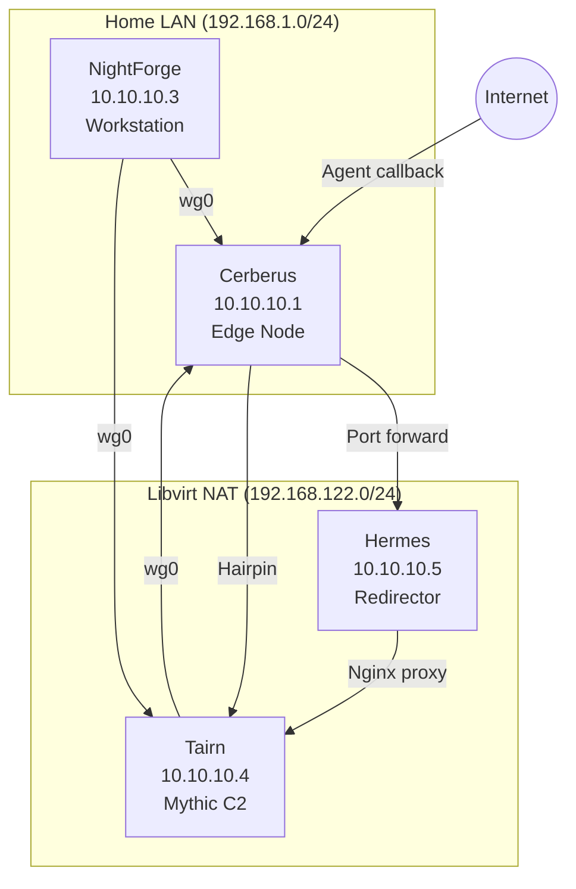
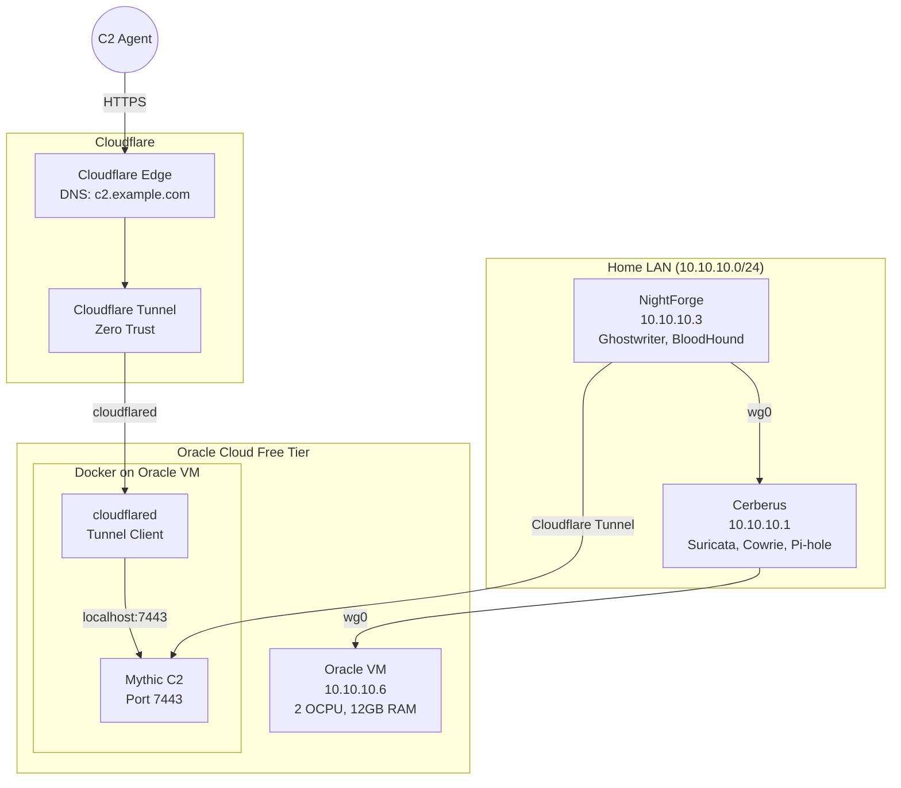

# Veil Architecture v2 — Cloud-Native/Hybrid Red Team Infrastructure

**Status:** Design Proposal | **Target:** $0/month cloud operating cost
**Last updated:** 2026-06-21

---

## Table of Contents

1. [Executive Summary](#executive-summary)
2. [Architecture Options](#architecture-options)
3. [Option A — Hybrid Cloud (RECOMMENDED)](#option-a--hybrid-cloud-recommended)
4. [Option B — Full Cloud](#option-b--full-cloud)
5. [Option C — Cloudflare Tunnel Only](#option-c--cloudflare-tunnel-only)
6. [Oracle Cloud Free Tier — Capabilities & Limits](#oracle-cloud-free-tier--capabilities--limits)
7. [Topology Diagrams](#topology-diagrams)
8. [Migration Plan](#migration-plan)
9. [Cost Analysis](#cost-analysis)
10. [OPSEC Improvements](#opsec-improvements)
11. [Risk Assessment](#risk-assessment)
12. [Implementation Roadmap](#implementation-roadmap)

---

## Executive Summary

Veil currently runs as a 4-node WireGuard mesh on local hardware (Cerberus, NightForge, Tairn, Hermes). This design proposes migrating the C2 infrastructure (Mythic, redirector) to Oracle Cloud free tier while keeping local detection/compute nodes on-premises.

**Why migrate:**
- **OPSEC:** Cloud C2 with Cloudflare Tunnel is harder to block than a home IP
- **Availability:** Oracle Cloud has SLA; home ISP can go down or change IP
- **Disposability:** Cloud VMs can be destroyed and recreated faster than local VMs
- **Career signal:** "Deployed C2 infrastructure on Oracle Cloud with Cloudflare Tunnel" > "ran VMs on my desktop"
- **Cost:** $0/month with free tier

**Why keep local nodes:**
- Cerberus (Suricata, Cowrie, Pi-hole) needs raw network access to home LAN
- NightForge (workstation) is a physical machine — can't migrate
- Lab targets (AD, training VMs) benefit from local network throughput
- Home internet bandwidth is cheaper than cloud egress for large data transfers

---

## Architecture Options

| Dimension | Option A: Hybrid Cloud | Option B: Full Cloud | Option C: Cloudflare Tunnel Only |
|-----------|----------------------|---------------------|--------------------------------|
| **Mythic C2** | Oracle Cloud VM | Oracle Cloud VM | NightForge (local) |
| **Redirector** | Cloudflare Tunnel | Cloudflare Tunnel | Cloudflare Tunnel |
| **Cerberus** | Local (home) | Decommission | Local (home) |
| **NightForge** | Local (workstation) | Local (workstation) | Local (workstation) |
| **Tairn** | Decommission | Decommission | Decommission |
| **Hermes** | Decommission | Decommission | Decommission |
| **Upfront effort** | Moderate (2-3 days) | High (1 week) | Low (4 hours) |
| **OPSEC gain** | High | Very High | Moderate |
| **Cost/month** | $0 | $0 | $0 |

### Option A — Hybrid Cloud (RECOMMENDED)

**Architecture:**

```
                      Cloudflare Edge
                           │
                    Cloudflare Tunnel
                    (cloudflared, HTTPS)
                           │
                    ┌──────▼──────┐
                    │  Oracle VM  │
                    │ (Ampere A1) │
                    │             │
                    │ Mythic C2   │
                    │ Docker      │
                    │ Port 7443   │
                    └─────────────┘
                           │ WireGuard (10.10.10.0/24)
                           │
                    ┌──────▼──────┐
                    │  Cerberus   │
                    │ (home, Arch)│
                    │             │
                    │ Suricata    │
                    │ Cowrie      │
                    │ Pi-hole     │
                    │ nftables    │
                    └─────────────┘
                           │ WireGuard (10.10.10.0/24)
                           │
                    ┌──────▼──────┐
                    │ NightForge  │
                    │ (home, Arch)│
                    │             │
                    │ Operator WS │
                    │ Ghostwriter │
                    │ BloodHound  │
                    │ Lab VMs     │
                    └─────────────┘
```

### Option B — Full Cloud

Migrate everything to cloud except NightForge. Cerberus replaced by cloud-based IDS/honeypot.

**Not recommended because:**
- Raw network tap (Suricata on LAN) can't be replicated in cloud
- Pi-hole DNS filtering requires LAN integration
- Honeypot on cloud IP attracts different threat profile than residential IP

### Option C — Cloudflare Tunnel Only

Keep all infra local, add Cloudflare Tunnel as redirector layer in front of Hermes.

**Good quick win but:** Doesn't address Tairn reliability (local VM) or Cerberus single-point-of-failure.

---

## Option A — Hybrid Cloud (RECOMMENDED)

### Node Roles

| Node | Location | Role | Spec |
|------|----------|------|------|
| **Oracle VM** | Oracle Cloud (free tier) | Mythic C2 server, Cloudflare Tunnel client | 2 OCPU, 12GB RAM, Ubuntu 24.04 |
| **Cerberus** | Home LAN | Edge node — Suricata, Cowrie, Pi-hole, nftables, Caddy, Gitea, Vaultwarden | Chromebook N5030, 8GB RAM, Arch |
| **NightForge** | Home LAN | Operator workstation — Ghostwriter, BloodHound, Docker, Podman, lab VMs | i3-10105F, 32GB RAM, GTX 1650, Arch |

### Network Architecture

```
                         Internet
                            │
                     ┌──────▼──────┐
                     │  Cloudflare │
                     │  DNS + CDN  │
                     │  c2.example │
                     └──────┬──────┘
                            │ Cloudflare Tunnel (cloudflared)
                            │
                     ┌──────▼──────┐
                     │  Oracle VM  │
                     │  10.10.10.6 │
                     │  Mythic:7443│
                     └──────┬──────┘
                            │ WireGuard mesh (10.10.10.0/24)
                            │
                    ┌───────┴────────┐
                    │                │
            ┌───────▼──────┐  ┌──────▼────────┐
            │   Cerberus   │  │  NightForge   │
            │  10.10.10.1  │  │  10.10.10.3   │
            │  (home)      │  │  (home)       │
            └──────────────┘  └───────────────┘
```

### Traffic Flows

**C2 Agent Callback (agent → cloudflare → oracle → mythic):**
```
Agent → Cloudflare Edge → Cloudflare Tunnel → Oracle VM → Mythic (local:7443)
```

**Operator to C2 Web UI (nightforge → oracle):**
```
NightForge ──wg0── Cerberus ──wg0── Oracle VM:7443
```

or via Cloudflare Tunnel for remote ops:
```
NightForge (any network) → Cloudflare Tunnel auth → Oracle VM:7443
```

---

## Oracle Cloud Free Tier — Capabilities & Limits

### Compute (Always Free — verified 2026)

| Resource | Limit | Notes |
|----------|-------|-------|
| Ampere A1 cores | 4 OCPUs total across all instances | Can split 2+2 or use 1x big instance |
| Ampere A1 RAM | 24 GB total | 12 GB per Mythic instance is plenty |
| Block storage | 200 GB total | 100 GB for OS + Mythic Docker volumes |
| Network bandwidth | Up to 4 Gbps (theoretical) | Depends on region/instance shape |
| Outbound data | 10 TB/month | Generous for C2 ops |
| Public IP | 1 static ephemeral (can reserve) | Can attach to instance |
| VCN | 2 free | One for C2, one for future use |

### Capacity Warnings

- **Resource contention:** A1 instances share capacity. Some regions (us-ashburn-1, eu-frankfurt-1) frequently show "out of capacity" for free tier. Try eu-marseille-1, ap-osaka-1, or sa-santiago-1 if popular regions are full.
- **Idle reclaim:** VMs idle for 7+ days (single-digit % CPU) may be reclaimed. Mythic with periodic beacon activity should keep CPU > 0%.
- **No GPU:** Free tier has no GPU. Anything needing GPU stays on NightForge.

### Recommended Shape

**VM.Standard.A1.Flex** — 2 OCPUs, 12 GB RAM, 100 GB boot volume
- Mythic Docker stack uses ~4-6 GB RAM idle, ~8 GB under load
- 2 OCPUs sufficient for Mythic + cloudflared + basic monitoring

---

## Topology Diagrams

### Current Architecture (v1)



### Target Architecture (v2 — Hybrid Cloud)



---

## Migration Plan

### Phase 1 — Oracle Cloud Setup (Day 1)

```bash
# 1. Create Oracle Cloud free tier account
#    - Use credit card for verification
#    - Choose region with A1 capacity (try eu-marseille-1)

# 2. Provision VM.Standard.A1.Flex (2 OCPU, 12GB RAM, Ubuntu 24.04)
#    - Assign public IP
#    - Configure security list: allow 22 (SSH), 51820 (WG) from home IP

# 3. Initial hardening
ssh ubuntu@<oracle-public-ip>
sudo apt update && sudo apt upgrade -y
sudo ufw allow 22/tcp
sudo ufw allow 51820/udp
sudo ufw enable

# 4. Install Docker + Docker Compose
curl -fsSL https://get.docker.com | sh
sudo usermod -aG docker ubuntu
```

### Phase 2 — Mythic on Oracle (Day 1-2)

```bash
# 5. Deploy Mythic
git clone https://github.com/its-a-feature/Mythic.git /opt/Mythic
cd /opt/Mythic
sudo ./install_docker_ubuntu.sh
make

# 6. Configure Mythic
#    - Set external URL to c2.example.com (via Cloudflare)
#    - Configure Let's Encrypt or self-signed cert
#    - Set admin password

# 7. Verify Mythic is running
sudo docker compose ps
sudo docker compose logs mythic_server -f
```

### Phase 3 — WireGuard Mesh (Day 2)

```bash
# 8. Install WireGuard on Oracle VM
sudo apt install wireguard -y

# 9. Generate keys
wg genkey | tee /etc/wireguard/privatekey | wg pubkey > /etc/wireguard/publickey

# 10. Configure wg0.conf on Oracle VM
#     [Interface]
#     Address = 10.10.10.6/24
#     PrivateKey = <oracle-private-key>
#     ListenPort = 51820
#
#     [Peer]
#     # Cerberus
#     PublicKey = <cerberus-public-key>
#     Endpoint = <cerberus-wg-ip>:51820
#     AllowedIPs = 10.10.10.0/24
#     PersistentKeepalive = 25

# 11. Add Oracle VM peer to Cerberus wg0.conf
#     [Peer]
#     # Oracle Cloud Mythic
#     PublicKey = <oracle-public-key>
#     AllowedIPs = 10.10.10.6/32
```

### Phase 4 — Cloudflare Tunnel (Day 2-3)

```bash
# 12. Sign up for Cloudflare free tier
#     - Add domain (or use existing)
#     - Create DNS A record for c2.example.com → Oracle VM IP

# 13. Install cloudflared on Oracle VM
sudo apt install cloudflared -y

# 14. Authenticate and create tunnel
cloudflared tunnel login
cloudflared tunnel create c2-tunnel

# 15. Configure tunnel config.yml
#     tunnel: <tunnel-id>
#     credentials-file: /home/ubuntu/.cloudflared/<tunnel-id>.json
#     
#     ingress:
#       - hostname: c2.example.com
#         service: https://localhost:7443
#         originRequest:
#           noTLSVerify: true
#       - service: http_status:404

# 16. Configure DNS
cloudflared tunnel route dns c2-tunnel c2.example.com

# 17. Install as systemd service
sudo cloudflared service install

# 18. Verify tunnel is running
cloudflared tunnel list
sudo systemctl status cloudflared
```

### Phase 5 — Decommission Old Nodes (Day 3)

```bash
# 19. Power down Tairn VM (10.10.10.4)
virsh -c qemu:///system destroy tairn

# 20. Power down Hermes VM (10.10.10.5)
virsh -c qemu:///system destroy hermes

# 21. Remove old references from configs
#     - Remove Tairn/Hermes from nftables.conf
#     - Remove Tairn/Hermes from Caddyfile
#     - Remove Tairn/Hermes from NOC scripts
#     - Update WG peer lists
```

### Phase 6 — Cleanup & Verify (Day 3)

```bash
# 22. Verify C2 callback path
curl -k https://c2.example.com
# Should reach Mythic nginx

# 23. Verify mesh connectivity
ping 10.10.10.6  # Oracle VM via WG
ssh ubuntu@10.10.10.6

# 24. Update all docs
#     - Commit ARCHITECTURE-v2.md
#     - Update README architecture diagram
#     - Remove references to Tairn/Hermes
#     - Add Oracle VM and Cloudflare Tunnel docs
```

---

## Cost Analysis

### Monthly Costs ($0 target)

| Service | Component | Cost | Notes |
|---------|-----------|------|-------|
| Oracle Cloud | VM.Standard.A1.Flex (2 OCPU, 12GB) | $0 | Always Free tier |
| Oracle Cloud | Block storage (100 GB) | $0 | 200 GB included |
| Oracle Cloud | Outbound data transfer | $0 | 10 TB/month included |
| Oracle Cloud | Public IP | $0 | 1 static ephemeral included |
| Cloudflare | DNS + Tunnel | $0 | Free tier |
| Cloudflare | CDN | $0 | Free tier includes CDN |
| Domain | c2.example.com | ~$10-15/year | One-time annual cost |
| Home hosting | Cerberus + NightForge | Already owned | Electricity ~$20-30/month |
| **Total** | | **$0/month** | |

### What $0 Buys (vs current infra)

| Capability | Current (v1) | Target (v2) |
|------------|-------------|-------------|
| C2 availability | When Tairn VM is running (manual) | 24/7/365 (cloud SLA) |
| C2 bandwidth | Home ISP (~100 Mbps) | Oracle Cloud (~4 Gbps) |
| Redirector | Nginx on Alpine VM | Cloudflare global edge |
| C2 IP rotation | Rebuild Hermes VM | Destroy/recreate cloud VM |
| DDoS protection | None | Cloudflare built-in |
| TLS | Self-signed cert | Cloudflare edge managed |
| Data egress | Home ISP (no cap) | 10 TB/month free |

### Hidden Costs to Watch

- **Oracle region capacity:** If your region is full, you may need to try multiple regions. Each region switch costs time, not money.
- **Domain registration:** ~$10-15/year for a C2 domain. Use `.com` or `.xyz` for cheap.
- **Cloudflare Pro:** Free tier works for basic tunnel. Zero Trust plan ($7/user/month) adds features but is unnecessary for a single C2 tunnel.
- **Home ISP:** No change — Cerberus and NightForge stay local.

---

## OPSEC Improvements

### v1 Problems Solved

| v1 Problem | v2 Solution |
|-----------|-------------|
| C2 accessible at home IP | Cloudflare masks origin — home IP not exposed |
| Tairn VM requires manual start | Oracle VM runs 24/7 with cloud SLA |
| Hermes nginx self-signed cert | Cloudflare managed TLS with valid certs |
| Redirector IP burned when detected | Destroy/recreate Oracle VM (5 min) |
| WireGuard mesh complex | Simplified to 3-node mesh |
| No domain fronting | Cloudflare Tunnel inherently fronted |

### New OPSEC Considerations

| Concern | Mitigation |
|---------|-----------|
| Oracle account tied to real identity | Use a privacy-focused email + prepaid card for signup. Cloud account is unavoidable for free tier. |
| Cloudflare sees all C2 traffic | Tunnel encrypts between edge and server. Cloudflare can see metadata (IPs, timing) but not decrypted payload. |
| Domain registration exposes identity | Use WHOIS privacy protection (included with most registrars). Consider .xyz or .press for cheap registration. |
| Oracle VM public IP | Only expose port 51820 (WG) and 22 (SSH) from home IP. All HTTP goes through Cloudflare. |
| Tunnel downtime | cloudflared auto-restarts. Monitor with systemd. Add uptime monitoring (UptimeRobot free tier). |

### Logging & Monitoring (v2)

| Log Source | Retention | Destination |
|-----------|-----------|------------|
| Mythic operational logs | Engagement duration + 30 days | Oracle VM local volume |
| cloudflared tunnel logs | 7 days | journald (Oracle VM) |
| WireGuard handshake status | Real-time | NOC dashboard (Cerberus) |
| Suricata alerts | 30 days | Cerberus local (unchanged) |
| Cowrie session logs | 30 days | Cerberus local (unchanged) |
| Cloudflare audit logs | Variable | Cloudflare dashboard |

### Key Rotation

- WireGuard keys rotated per engagement
- Oracle VM SSH keys rotated per rebuild
- Cloudflare API tokens scoped to tunnel only, rotated quarterly
- Mythic admin credentials rotated quarterly
- No keys committed to repo (already standard practice)

---

## Risk Assessment

| Risk | Probability | Impact | Mitigation |
|------|------------|--------|------------|
| Oracle deletes free tier | Low | High | Subscribe to OCI announcements. Keep local infra as fallback. |
| Oracle out of A1 capacity | Medium | Medium | Try 3+ regions before giving up. Multiple-region fallback list helps. |
| Cloudflare Tunnel outage | Low | Medium | C2 still reachable via direct WireGuard IP if needed. |
| Home internet outage | Medium | Medium | Operator can still access C2 via Cloudflare Tunnel from any internet connection. |
| Oracle idle reclaim | Low | Low | Mythic beacon keeps CPU active. Run cron job for keepalive. |
| Account termination (ToS) | Low | High | Don't run illegal operations. Red team lab authorized use is fine. |
| WireGuard key compromise | Low | High | Key rotation procedure exists (see docs/). |
| Cerberus hardware failure | Medium | High | Pi-hole has fallback DNS. Services can be temporarily hosted on Oracle VM. |

### Fallback Plan

If Oracle Cloud free tier becomes unavailable, the architecture degrades gracefully:

1. **Remove Oracle VM** → Mythic runs on NightForge Docker (as it does today)
2. **Cloudflare Tunnel** → Still works, points to NightForge exposed port (with port forwarding on home router)
3. **Cerberus + NightForge** → Unchanged. No functionality loss, just loss of cloud benefits.

---

## Implementation Roadmap

### Phase A — Foundation (Week 1)

| Task | Who | Time |
|------|-----|------|
| Sign up for Oracle Cloud free tier | Operator | 30 min |
| Provision VM.Standard.A1.Flex | Operator | 1 hour |
| Harden VM (ufw, SSH key, updates) | Operator | 1 hour |
| Install Docker + Docker Compose | Operator | 30 min |
| Configure WireGuard on Oracle VM | Operator | 1 hour |
| Add Oracle VM to Cerberus WG peer | Operator | 15 min |
| Verify mesh connectivity | Operator | 15 min |

### Phase B — Mythic Migration (Week 1-2)

| Task | Who | Time |
|------|-----|------|
| Deploy Mythic on Oracle VM | Operator | 1 hour |
| Configure Mythic (C2 profile, users) | Operator | 1 hour |
| Test agent generation on Mythic | Operator | 1 hour |
| Migrate existing agents/callbacks | Operator | 2 hours |
| Set up automated backup for Mythic configs | Operator | 30 min |

### Phase C — Cloudflare Tunnel (Week 2)

| Task | Who | Time |
|------|-----|------|
| Register domain (or configure existing) | Operator | 30 min |
| Set up Cloudflare DNS + Tunnel | Operator | 1 hour |
| Configure tunnel ingress rules | Operator | 30 min |
| Test callback through tunnel | Operator | 1 hour |
| Set up tunnel monitoring (uptime check) | Operator | 30 min |

### Phase D — Decommission (Week 2-3)

| Task | Who | Time |
|------|-----|------|
| Power down Tairn VM | Operator | 5 min |
| Power down Hermes VM | Operator | 5 min |
| Update nftables.conf (remove old IPs) | Operator | 15 min |
| Update Caddyfile (remove old targets) | Operator | 15 min |
| Update NOC scripts | Operator | 30 min |
| Update README and docs | Operator | 1 hour |
| Commit all changes | Operator | 15 min |

---

## Appendix: Terraform Skeleton (Oracle Cloud)

```hcl
# providers.tf
terraform {
  required_providers {
    oci = {
      source = "oracle/oci"
      version = ">= 6.0"
    }
  }
}

provider "oci" {
  tenancy_ocid     = var.tenancy_ocid
  user_ocid        = var.user_ocid
  fingerprint      = var.fingerprint
  private_key_path = var.private_key_path
  region           = var.region
}

# main.tf
resource "oci_core_instance" "mythic_c2" {
  availability_domain = data.oci_identity_availability_domains.ads.availability_domains[0].name
  compartment_id      = var.compartment_ocid
  shape               = "VM.Standard.A1.Flex"
  
  shape_config {
    ocpus         = 2
    memory_in_gbs = 12
  }
  
  source_details {
    source_type = "image"
    source_id   = data.oci_core_images.ubuntu.images[0].id
  }
  
  create_vnic_details {
    subnet_id              = oci_core_subnet.c2_subnet.id
    assign_public_ip       = true
    assign_private_dns_record = true
  }
  
  metadata = {
    ssh_authorized_keys = var.ssh_public_key
  }
}
```

---

*This document is a design proposal. All cloud accounts, domains, and tunnels should be set up by the operator following the migration plan above.*
